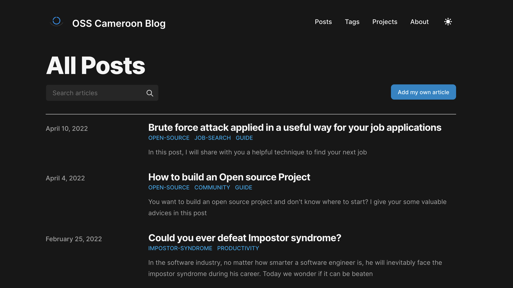

# OSS Cameroon Blog



## Installation

Clone the project

```bash
git clone https://github.com/osscameroon/blog.git oss-blog
cd blog
npm install
```

## Development

First, run the development server:

```bash
npm start
```

Open [http://localhost:3000](http://localhost:3000) with your browser to see the result.

You can start editing the page by modifying `pages/index.js`. The page auto-updates as you edit the file.

## Post

### Frontmatter

Frontmatter follows [Hugo's standards](https://gohugo.io/content-management/front-matter/).

Currently 7 fields are supported.

```
title (required)
date (required)
tags (required, can be empty array)
lastmod (optional)
draft (optional)
summary (optional)
images (optional, if none provided defaults to socialBanner in siteMetadata config)
authors (optional list which should correspond to the file names in `data/authors`. Uses `default` if none is specified)
layout (optional list which should correspond to the file names in `data/layouts`)
canonicalUrl (optional, canonical url for the post for SEO)
```

Here's an example of a post's frontmatter:

```
---
title: 'OSS Cameroon vision'
date: '2022-05-20'
lastmod: '2022-05-22'
tags: ['open-source', 'community', 'guide']
draft: false
summary: 'This community has been created to solve an issue in the Cameroonian developer's community. This post explains our goal and where we want to go with this project.'
images: ['/static/images/post.jpg']
authors: ['default', 'tericcabrel']
layout: PostLayout
canonicalUrl: https://blog.osscameroon.com/posts/oss-cameroon-vision
---
```

### Create a new post

Run the command below to create a new post.
Follow the interactive prompt to generate a post with pre-filled front matter.

```shell
npm run create-post
```

## How to add a blog post
We wrote a whole post to guide on how to write and publish an article on OSS Cameroon blog. [Check it out](https://blog.osscameroon.com/posts/how-to-write-a-post-on-oss-cameroon-blog).

## Credits
This blog is built from this excellent blog template [Tailwing Next.js Starter Blog](https://github.com/timlrx/tailwind-nextjs-starter-blog). Star and share the repository to support the author. 
